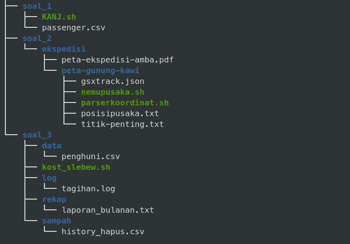
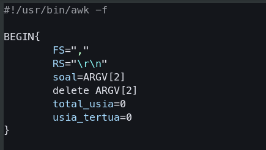
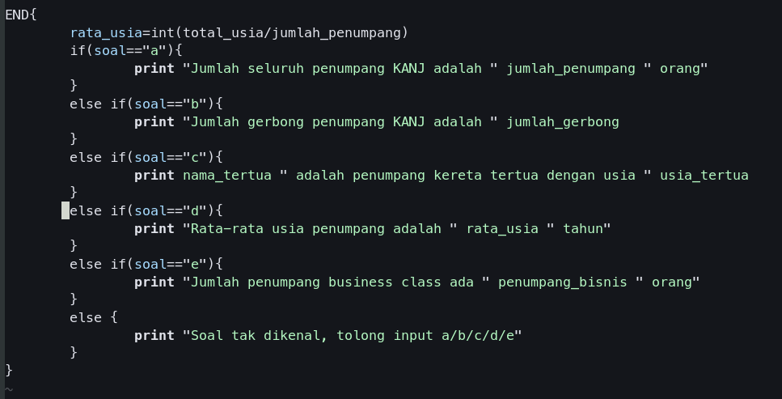

# SISOP-1-2026-IT-096
# Praktikum Sistem Operasi Modul 1
by Afriezal Suryapraba Laiasach | 5027251096

### Tree file tugas



## Soal 1
Di soal ini, kita diberi sebuah file csv bernama passenger.csv dalam bentuk link untuk didownload.  
kita bisa mendownload file ini menggunakan:  
`wget -O passenger.csv "(link file csv)"`  

Dari file csv tersebut, kita diperintahkan untuk:   
a. Menghitung jumlah semua penumpang kereta  
b. Jumlah gerbong kereta  
c. Siapa penumpang tertua dan berapa umurnya  
d. Rata-rata usia penumpang  
e. Jumlah penumpang bussiness class  

setelah didownload, kita dapat memulai mengerjakan scriptnya. Sesuai dengan soal, script nya akan saya namakan KANJ.sh. Untuk pengerjaan penulisan script, saya menggunakan Vim sehingga untuk membuat file .sh dapat dilakukan dengan:  
`vim KANJ.sh`  

### Script KANJ.sh
Di file csv, setiap kolom dilambangkan oleh '$'. Jadi sesuai dengan isi file passenger.csv, urutan kolom sebagai berikut:  
$1 = Nama penumpang  
$2 = Usia penumpang  
$3 = Kelas  
$4 = Gerbong penumbang  

kita akan menggunakan `awk` , sebuah bahasa pemrograman khusus untuk pemrosesan teks, ekstraksi data, dan pembuatan laporan terstruktur pada sistem Unix/Linux.  
#### BEGIN



Pada soal kita diberitahu bahwa untuk meng-output file, kita diarahkan untuk menggunakan:  
`awk -f KANJ.sh passenger.csv a/b/c/d/e`  

Karena hal itu kita menggunakan *shebang* `#!/usr/bin/awk -f` .  
Hal ini digunakan untuk memberitahu sistem operasi bahwa file ini harus dijalankan menggunakan program awk.   

Pada blok pertama seperti yang di gambar adalah blok BEGIN. Blok ini menjalankan perintah sebanyak satu  kali sebelum file dibaca oleh awk.   

`FS= ","` FS (Field Seperator) menentukan pemisah antar kolom berupa tanda koma (,).  
`RS="\r\n"` RS(Record Seperator) menentukan bahwa setiap baris yang diakhiri \r\n.  hal ini penting digunakan untuk menghitung gerbong.  
`soal=ARGV[2]` Mengambil argumen yang diketik di terminal.  ([0]=program yang digunakan(awk),[1]=file yang dibaca(passenger.csv),[2]=argumen tambahan(untuk soal ini a/b/c/d/e)). Argumen disimpan di variabel bernama soal.  
`delete ARGV[2]` Menghapus argumen agar tidak dibuka awk dan menyebabkan error.  
`total_usia=0` & `usia_tertua=0` menyiapkan variabel untuk digunakan dengan nilai awal 0. 

#### Pemrosesan Data


Blok ini diawali dengan `NR>1` yang dimana menyatakan bahwa program didalam kurung kurawal hanya berlaku untuk baris ke-2 dan seterusnya. hal ini dilakukan agar bagian header tidak terbaca dan menyebabkan error.  

`jumlah_penumpang++` digunakan untuk menghitung berapa banyak orang yang ada di data.  

```shell
if(!gerbong[$4]++){
		jumlah_gerbong++
	}
```     
ini adalah perintah untuk menghitung gerbong, `gerbong[$4]` adalah array untuk mencatat gerbong, tanda `!` dan `++` memastikan bahwa `jumlah_gerbong++` hanya akan berjalan jika nama gerbong tersebut belum pernah muncul/unik.   

```shell
if($2>usia_tertua){
		usia_tertua=$2
		nama_tertua=$1
	}
```  
ini adalah perintah untuk mencari penumpang tertua beserta berapa umurnya. `$2>usia_tertua` berarti program akan mengecek kolom ke 2, jika lebih besar dari 'usia_tertua' saat ini yang bernilai 0, isi dari variabel 'usia_tertua' berganti dan akan terus dilakukan hingga selesai beserta mengambil nama orang dengan umur tertua.  
``` shell
	total_usia += $2
```  
ini adalah perintah untuk menghitung total semua usia, ini akan digunakan untuk menghitung rata-rata usia penumpang.  

```shell
    if($3 == "Business"){
		penumpang_bisnis++
	}
``` 
ini adalah perintah untuk menghitung banyak orang di kelas Business. `if($3 == "Business")` berarti perintah berjalan jika di kolom ke 3 terdapat kata "Business". Jika di kolom 3 sesuai, maka `penumpang_bisnis` ditambahkan 1.   

#### END  
  
Blok END akan dijalankan sekali setelah semua pembacaan dan pemrosesan file selesai.  
```shell
    rata_usia=int(total_usia/jumlah_penumpang)
```  
Setelah kolom usia ditambahkan, kita dapat menghitung rata-rata nya dengan membagi `total_usia` dengan `jumlah_penumpang`.  
```shell
if(soal=="a"){
		print "Jumlah seluruh penumpang KANJ adalah " jumlah_penumpang " orang"
	} 
	else if(soal=="b"){
		print "Jumlah gerbong penumpang KANJ adalah " jumlah_gerbong
	} 
	else if(soal=="c"){
		print nama_tertua " adalah penumpang kereta tertua dengan usia " usia_tertua
	} 
	else if(soal=="d"){
		print "Rata-rata usia penumpang adalah " rata_usia " tahun"
	} 
	else if(soal=="e"){
		print "Jumlah penumpang business class ada " penumpang_bisnis " orang"
	} 
	else {
		print "Soal tak dikenal, tolong input a/b/c/d/e"
	}
```  
Perintah ini digunakan untuk mengeluarkan hasil pemrosesan data. Seperti yang sudah dijelaskan di blok BEGIN, variabel soal akan mengambil argumen(a/b/c/d/e) setelah passenger.csv di terminal dan mengeluarkan sesuai dengan apa yang diketikan.

#### Output  
Untuk menjalankan program dengan menggunakan perintah:
```shell
awk -f KANJ.sh passenger.csv a/b/c/d/e
```  
Begini hasil outputnya:  
##### Jumlah penumpang
!

