# SISOP-1-2026-IT-096
# Praktikum Sistem Operasi Modul 1
by Afriezal Suryapraba Laiasach | 5027251096

### Tree file tugas


## Soal 1
Di soal ini, kita diberi sebuah file csv bernama passenger.csv dalam bentuk link untuk didownload.  
kita bisa mendownload file ini menggunakan:  
`wget -O passenger.csv "(link file csv)"`  

Dari file csv tersebut, kita diperintahkan untuk:   
a. Menghitung jumlah semua penumpang kereta  
b. Jumlah gerbong kereta  
c. Siapa penumpang tertua dan berapa umurnya  
d. Rata-rata usia penumpang  
e. Jumlah penumpang bussiness class  

setelah didownload, kita dapat memulai mengerjakan scriptnya. Sesuai dengan soal, script nya akan saya namakan KANJ.sh. Untuk pengerjaan penulisan script, saya menggunakan Vim sehingga untuk membuat file .sh dapat dilakukan dengan:  
`vim KANJ.sh`  

### Script KANJ.sh
Di file csv, setiap kolom dilambangkan oleh '$'. Jadi sesuai dengan isi file passenger.csv, urutan kolom sebagai berikut:  
$1 = Nama penumpang  
$2 = Usia penumpang  
$3 = Kelas  
$4 = Gerbong penumbang  

kita akan menggunakan `awk` , sebuah bahasa pemrograman khusus untuk pemrosesan teks, ekstraksi data, dan pembuatan laporan terstruktur pada sistem Unix/Linux.  
#### BEGIN


Pada soal kita diberitahu bahwa untuk meng-output file, kita diarahkan untuk menggunakan:  
`awk -f KANJ.sh passenger.csv a/b/c/d/e`  

Karena hal itu kita menggunakan *shebang* `#!/usr/bin/awk -f` .  
Hal ini digunakan untuk memberitahu sistem operasi bahwa file ini harus dijalankan menggunakan program awk.   

Pada blok pertama seperti yang di gambar adalah blok BEGIN. Blok ini menjalankan perintah sebanyak satu  kali sebelum file dibaca oleh awk.   

`FS= ","` FS (Field Seperator) menentukan pemisah antar kolom berupa tanda koma (,).  
`RS="\r\n"` RS(Record Seperator) menentukan bahwa setiap baris yang diakhiri \r\n.  hal ini penting digunakan untuk menghitung gerbong.  
`soal=ARGV[2]` Mengambil argumen yang diketik di terminal.  ([0]=program yang digunakan(awk),[1]=file yang dibaca(passenger.csv),[2]=argumen tambahan(untuk soal ini a/b/c/d/e)). Argumen disimpan di variabel bernama soal.  
`delete ARGV[2]` Menghapus argumen agar tidak dibuka awk dan menyebabkan error.  
`total_usia=0` & `usia_tertua=0` menyiapkan variabel untuk digunakan dengan nilai awal 0. 

#### Pemrosesan Data


Blok ini diawali dengan `NR>1` yang dimana menyatakan bahwa program didalam kurung kurawal hanya berlaku untuk baris ke-2 dan seterusnya. hal ini dilakukan agar bagian header tidak terbaca dan menyebabkan error.  

`jumlah_penumpang++` digunakan untuk menghitung berapa banyak orang yang ada di data.  

```shell
if(!gerbong[$4]++){
		jumlah_gerbong++
	}
```     
ini adalah perintah untuk menghitung gerbong, `gerbong[$4]` adalah array untuk mencatat gerbong, tanda `!` dan `++` memastikan bahwa `jumlah_gerbong++` hanya akan berjalan jika nama gerbong tersebut belum pernah muncul/unik.   

```shell
if($2>usia_tertua){
		usia_tertua=$2
		nama_tertua=$1
	}
```  
ini adalah perintah untuk mencari penumpang tertua beserta berapa umurnya. `$2>usia_tertua` berarti program akan mengecek kolom ke 2, jika lebih besar dari 'usia_tertua' saat ini yang bernilai 0, isi dari variabel 'usia_tertua' berganti dan akan terus dilakukan hingga selesai beserta mengambil nama orang dengan umur tertua.  
``` shell
	total_usia += $2
```  
ini adalah perintah untuk menghitung total semua usia, ini akan digunakan untuk menghitung rata-rata usia penumpang.  

```shell
    if($3 == "Business"){
		penumpang_bisnis++
	}
``` 
ini adalah perintah untuk menghitung banyak orang di kelas Business. `if($3 == "Business")` berarti perintah berjalan jika di kolom ke 3 terdapat kata "Business". Jika di kolom 3 sesuai, maka `penumpang_bisnis` ditambahkan 1.   

#### END  
  
Blok END akan dijalankan sekali setelah semua pembacaan dan pemrosesan file selesai.  
```shell
    rata_usia=int(total_usia/jumlah_penumpang)
```  
Setelah kolom usia ditambahkan, kita dapat menghitung rata-rata nya dengan membagi `total_usia` dengan `jumlah_penumpang`.  
```shell
if(soal=="a"){
		print "Jumlah seluruh penumpang KANJ adalah " jumlah_penumpang " orang"
	} 
	else if(soal=="b"){
		print "Jumlah gerbong penumpang KANJ adalah " jumlah_gerbong
	} 
	else if(soal=="c"){
		print nama_tertua " adalah penumpang kereta tertua dengan usia " usia_tertua
	} 
	else if(soal=="d"){
		print "Rata-rata usia penumpang adalah " rata_usia " tahun"
	} 
	else if(soal=="e"){
		print "Jumlah penumpang business class ada " penumpang_bisnis " orang"
	} 
	else {
		print "Soal tak dikenal, tolong input a/b/c/d/e"
	}
```  
Perintah ini digunakan untuk mengeluarkan hasil pemrosesan data. Seperti yang sudah dijelaskan di blok BEGIN, variabel soal akan mengambil argumen(a/b/c/d/e) setelah passenger.csv di terminal dan mengeluarkan sesuai dengan apa yang diketikan.

#### Output  
Untuk menjalankan program dengan menggunakan perintah:
```shell
awk -f KANJ.sh passenger.csv a/b/c/d/e
```  
Begini hasil outputnya:  
##### Jumlah penumpang
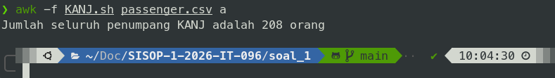  
##### Jumlah Gerbong

##### Penumpang tertua
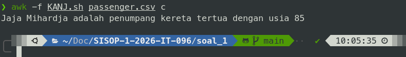
##### Rata-rata usia penumpang  
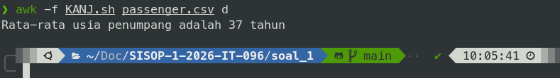
##### Jumlah penumpang business
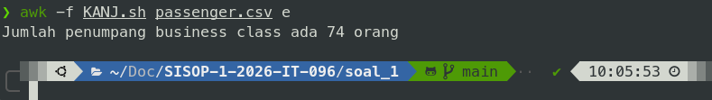
##### Jika argumen tidak sesuai
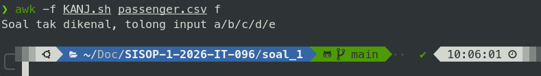  

## Soal 2

Di soal ini kita diberikan suatu link untuk mendownload file menggunakan command gdown. Cara mendownloadnya kita dapat mengcopy id file di link ang diberikan dan mengetikan perintah di terminal:  
```gdown --id "id file" -O nama yang dinginkan```  
yang dimana kita akan memasukan:  
```gdown --id "1q10pHSC3KFfvEiCN3V6PTroPR7YGHF6Q" -O peta-ekspedisi-amba.pdf```  
Setelah berhasil mendownload, kita mendapatkan sebuah file bernama 'peta-ekspedisi-amba.pdf' yang kemudian akan kita letakkan di folder bernama ekspedisi.  File ini akan kita buka dengan perintah ```cat``` diterminal.   

Setelah dibuka dengan ```cat``` , kita menemukan sebuah link:   
```https://github.com/pocongcyber77/peta-gunung-kawi.git```  
Jika kita membuka link ini, akan terbuka sebuah repository github. Di dalam repository tersebut terdapat file bernama ```gsxtrack.json```. Agar bisa kita kerjakan soal ini, kita akan melakukan clone repository dengan perintah di terminal:  
```git clone https://github.com/pocongcyber77/peta-gunung-kawi.git```   

Setelah kita clone repository, kita dapat lanjut mengerjakan tugasnya didalam folder bernama peta-gunung-kawi. Tugas yang diberikan ialah:  
a. Mengambil data dari gsxtrack.json  
b. Gunakan dat tersebut untuk mencari titik tengah yang dimana lokasi pusaka berada  

### Script
Disini kita akan membuat dua script, script untuk mengambil data dan script untuk mencari titik tengah. Script pertama akan dinamai "parserkoordinat.sh" dan script kedua dinamai "nemupusaka.sh".  

#### parserkoordinat.sh
Pada script ini, outputnya akan menjadi berupa file txt yang bernama "titik-penting.txt" yang akan berisi id, site_name, latitude, dan longitude.  

```shell
#!/bin/bash

input_file="gsxtrack.json"
output_file="titik-penting.txt"

grep -E '"id"|"site_name"|"latitude"|"longitude"' "$input_file"|\
sed -E 's/.*: //; s/[",]//g' | \
awk '{
	id=$0; getline;
	name=$0; getline;
	lat=$0; getline;
	lon=$0;
	printf "%s, %s, %s, %s\n",id, name, lat, lon
}' | sort > "$output_file"

echo "File $output_file yang dinginkan telah selesai dibuat"
```  

Pada kode ini kita menggunakan ```grep -E '"id"|"site_name"|"latitude"|"longitude"' "$input_file"|\``` untuk mengambil data dari file json.   

Kita menggunakan ```sed -E 's/.*: //; s/[",]//g' | \``` untuk kita hanya mengambil bagian yang kita perlukan, jadi yang awalnya ```"latitude": -7.928810``` Hanya akan menjadi ```-7.928810``` saja, sehingga bisa digunakan untuk melakukan perhitungan dan outputnya sesuai dengan tugas yang diberikan.  

Untuk penggunaan awk sendiri, digunakan untuk menggabungkan 4 data yang sudah diambil.  ```$0``` berarti kita mengambil data satu baris. ```getline``` digunakan untuk melanjutkan setelah data dapat terambil, misal id sudah terambil, lalu ambil data berikutnya.   
Sort digunakan agar berurutan sehingga dimulai dari id 1 hingga yang ke 4.  

Setelah dijalankan, akan dibuat sebuah file bernama ```titik-peenting.txt``` yang berisi data-data yang sudah kita ambil.

#### nemupusaka.sh
Setelah kita jalankan script sebelumnya dan mengambil data, kita akan mencari titik lokasi pusaka dengan rumus:  
$$\left( \frac{x_1 + x_2}{2}, \frac{y_1 + y_2}{2} \right)$$  

Karena kita mengambil titik tengah kita ambil dua titik yang berhadapan secara diagonal, misal titik 1 dan titik 3.  
```shell
#!/bin/bash

file="titik-penting.txt"
file_output="posisipusaka.txt"

lat1=$(awk -F',' 'NR==1 {print $3}' "$file")
lon1=$(awk -F',' 'NR==1 {print $4}' "$file")

lat2=$(awk -F',' 'NR==3 {print $3}' "$file")
lon2=$(awk -F',' 'NR==3 {print $4}' "$file")

lat_akhir=$(echo "scale=5;($lat1+$lat2) /2"|bc)
lon_akhir=$(echo "scale=5;($lon1+$lon2) /2"|bc)

echo "Koordinat pusatnya di: $lat_akhir, $lon_akhir"
echo "$lat_akhir, $lon_akhir" > $file_output
echo "Posisi pusaka sudah tercatat di $file_output"
```   

Kita akan ambil data dari ```titik-penting.txt``` yang sebelumnya sudah dibuat dengan menggunakan awk. Kita masukan menjadi variabel ```lat1``` dan ```lon1``` yang dimana merupakan letak latitude dan longitude titik pertama. Berikutnya adalah ```lat2``` dan ```lon2``` yang merupakan letak latitude dan longitude titik ke tiga. Letak data latitude di file berada di kolom ke 3 sehingga dipanggilah ```$3``` dan longitude berada di kolom ke 4 sehingga ```$4```.    

Setelah diambil menggunakan awk, kita dapat menghitungnya dengan cara tambahkan kedua latitude, lalu dibagi dua, lakukan juga dengan longitude, dan kita dapat hasilnya. Setelah dihitung, akan kita letakan hasilnya di file bernama ```posisi-pusaka.txt```  

#### Output
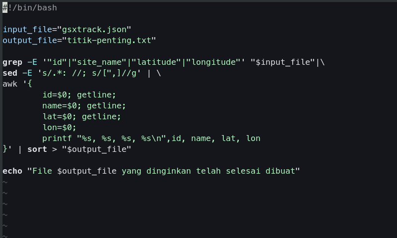   
Sebelum menjalankan script ```nemupusaka.sh``` kita menjalankan script ini dulu 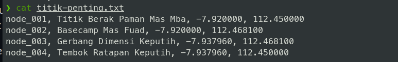  
setelah itu akan dibuat file ```titik-penting.txt``` beserta isinya   
  
Setelah data terkumpul, kita dapat menjalankan script kedua  
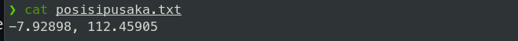  
setelah itu akan dibuat file ```posisi-pusaka.txt```

## Soal 3
Pada soal ini kita akan membuat sebuah sistem pencatatan data sebuah kos. Fitur-fitur yang diperlukan diantaranya:       

a.Fitur untuk menambah penghuni baru.    
b.Fitur untuk menghapus penghuni yang sudah tidak tinggal di kos.    
c.Fitur pembuatan laporan yang menyewa kamar.  
d.Fitur untuk merubah status penghuni (Aktif/Menunggak).  
e.Fitur pengingat tagihan menggunakan cronjob
f.Fitur untuk keluar program   

Scriptnya akan diberi nama kost_slebew.sh. Data-data nya akan di simpann di folder-folder yang berbeda.  

### Script
Script ini cukup panjang, jadi akan kita bahas satu persatu.  
#### Bagian Awal
```shell
#!/bin/bash

mkdir -p data log rekap sampah
touch data/penghuni.csv log/tagihan.log rekap/laporan_bulanan.txt sampah/history_hapus.csv

SCRIPT_PATH=$(realpath "$0")

if [[ "$1" == "--check-tagihan" ]]; then
	waktu=$(date +"%Y-%m-%d %H:%M:%S")
	awk -F, -v time="$waktu" 'tolower($5) == "menunggak"{
		printf "[%s] TAGIHAN: %s (Kamar %s) - Menunggak Rp%s\n", time, $1, $2, $3 >>"log/tagihan.log"
	}' data/penghuni.csv
	exit 0
fi
```

pada bagian awal, kita akan membuat directory dan file yang diperlukan untuk menyimpan data-datanya.   

```shell
SCRIPT_PATH=$(realpath "$0")
```  

ini digunakan saat cron mengeksekusi script ini nanti, cron berjalan di environment sistem latar belakang yang tidak tahu tempat menyimpan tugas ini. Dengan menangkap absolute path sejak awal, kita bisa mendaftarkan lokasi script yang akurat ke dalam crontab secara dinamis.   

Pada perintah berikutnya  
```shell
if [[ "$1" == "--check-tagihan" ]]; then
    waktu=$(date +"%Y-%m-%d %H:%M:%S")
    awk -F, -v time="$waktu" 'tolower($5) == "menunggak"{
        printf "[%s] TAGIHAN: %s (Kamar %s) - Menunggak Rp%s\n", time, $1, $2, $3 >>"log/tagihan.log"
    }' data/penghuni.csv
    exit 0
fi
```  

ini digunakan untuk mencatat tagihan otomatis, kita dapat menjalankan program ini dengan perintah ```./kost_slebew.sh --check-tagihan```. Ini akan digunakan juga untuk membuat fitur catat tagihan otomatis menggunakan cronjob.  

#### Tambah Penghuni
```shell
tambah_penghuni() {
	echo "=========================================="
    	echo "             TAMBAH PENGHUNI              "
    	echo "=========================================="
	read -p "Masuka Nama: " nama

	while true; do 
		read -p "Masukan Kamar: " kamar
		if grep -q  "^.*,$kamar,.*,.*,.*$" data/penghuni.csv; then
			echo "Error: Nomor kamar $kamar sudah terisi! pilih kamar yang lain (gaboleh tidur berdua cik)"
		else
			break
		fi
	done

	while true; do 
		read -p "Masukan harga sewa: " harga
		if [[ "$harga" =~ ^[0-9]+$ ]] && [ "$harga" -gt 0 ]; then
			break
		else
			echo "Error: Harga sewa nggak bisa minus (malah yang punya kos yang bayar njir)"
		fi
	done

	hari_ini=$(date +%Y-%m-%d)
	while true; do
		read -p "Masukan tanggal masuk (YYYY-MM-DD): " tanggal
		if [[ ! "$tanggal" =~ ^[0-9]{4}-[0-9]{2}-[0-9]{2}$ ]]; then
			echo "Error: format penanggalan salah, gunakan format timur (YYYY-MM-DD)"
			continue
		fi

		if ! date -d "$tanggal" >/dev/null 2>&1; then
			echo "Error: Tanggal nggak valid"
			continue
		fi

		if [[ "$tanggal" > "$hari_ini" ]]; then
			echo "Error: Tanggal tidak boleh dari masa depan (kamu bukan doraemon)"
		else
			break
		fi
	done

	while true; do
		read -p "Masukan status awal (Aktif/Menunggak): " status_bayar
		status_lower=$(echo "$status_bayar" | tr '[:upper:]' '[:lower:]')
		if [[ "$status_lower" == "aktif" ]]; then
			status="Aktif"
			break
		elif [[ "$status_lower" == "menunggak" ]]; then
			status="Menunggak"
			break
		else
			echo "Error: Yang bener aja cik. Kalo ngga Aktif, ya Menunggak (pilih satu)"
		fi
	done

	echo "$nama,$kamar,$harga,$tanggal,$status" >> data/penghuni.csv
	echo -e "\n[✓] Penghuni $nama berhasil ditambahkan!"
    	read -p "Tekan [ENTER] untuk kembali ke menu..."
}
```  
Pertama kita dapat memasukan nama. Selanjutnya, kita akan memasukan nomor kamar.  
```shell
if grep -q  "^.*,$kamar,.*,.*,.*$" data/penghuni.csv; then ...
```  
ini digunakan untuk mengecek di file penghuni.csv apakah nomor kamar yang dimasukan sudah terisi atau belum. Jika sudah terisi maka harus mengisi nomor berbeda. Setelah itu kita dapat memasukan harga sewa penghuni.  
```shell
if [[ "$harga" =~ ^[0-9]+$ ]] && [ "$harga" -gt 0 ]; then ...
```  
Perintah ini digunakan agar harga hanya boleh diisi angka 0-9 sehingga tidak boleh ada simbol lain dan harga tidak boleh bernilai minus.  
Setelah memasukan harga, kita dapat memasukan tanggal penghuni masuk.  
```shell
hari_ini=$(date +%Y-%m-%d)
if [[ ! "$tanggal" =~ ^[0-9]{4}-[0-9]{2}-[0-9]{2}$ ]]; then ...
```
Pertama-tama, program akan mengambil data tanggal hari ini, berikutnya program melakukan beberapa pengecekan. Perintah pertama ini digunakan untuk mengecek penggunaan format penanggalan. Format penanggalan yang akan digunakan adalah YYYY-MM-DD. Dari perintah tersebut kita hanya boleh mengisi angka 0-9 berjumlah 4 digit, garis strip (-),angka 0-9 berjumlah 2 digit, garis strip (-), lalu angka 0-9 berjumlah 2 digit. Jika misal kita menggunakan format DD-MM-YYYY maka akan muncul pesan error.  
```shell
if ! date -d "$tanggal" >/dev/null 2>&1; then ...
```
Ini digunakan untuk mengecek kevalidan tanggal dengan cara menerjemahkan mengecek date apakah sesuai atau tidak, contoh tanggal tidak valid misal 2020-02-30. ```>/dev/null 2>$1``` digunakan untuk membuang teks error bawaan agar dapat kita gantikan dengan pesan error kita sendiri.  
```shell
if [[ "$tanggal" > "$hari_ini" ]]; then ...
```
Ini digunakan untuk mengecek agar tanggal yang dimasukkan tidak dari masa depan.  Berikutnya kita dapat memasukan status penghuni  
```shell
status_lower=$(echo "$status_input" | tr '[:upper:]' '[:lower:]')
```  
Perintah pertama digunakan agar jika dimasukan huruf kapital, akan menjadi huruf kapitil untuk mencegah terjadinya error saat memasukan status karena perbedaan besar huruf.  

#### Hapus Penghuni
```shell
hapus_penghuni() {
	echo "=========================================="
    	echo "              HAPUS PENGHUNI              "
    	echo "=========================================="
    	read -p "Masukkan nama penghuni yang akan dihapus: " nama
	
	record=$(awk -F, -v n="$nama" 'tolower($1)==tolower(n) {print $0; exit}' data/penghuni.csv)

	if [[ -n "$record" ]]; then
		tanggal_hapus=$(date +%Y-%m-%d)
		echo "$record,$tanggal_hapus" >> sampah/history_hapus.csv

		awk -F, -v n="$nama" 'tolower($1)!=tolower(n)' data/penghuni.csv > data/temp.csv
		mv data/temp.csv data/penghuni.csv

		echo -e "\n[✓] Data penghuni \"$nama\" berhasil diarsipkan ke sampah/history_hapus.csv dan dihapus dari sistem."
	else
		echo -e "\n[X] Data penghuni \"$nama\" tidak ditemukan."
	fi
	read -p "Tekan [ENTER] untuk kembali ke menu..."
}
```
Kita dapat menghapus data penghuni dengan mengetikan nama penghuninya.  
```shell
record=$(awk -F, -v n="$nama" 'tolower($1)==tolower(n) {print $0; exit}' data/penghuni.csv)
```
Perintah ini digunakan untuk melakukan pengecekan apakah nama ada di database, jika ada akan dicetak seluruh baris dan disimpan ke variabel ```$record```.  
```shell
	if [[ -n "$record" ]]; then
		tanggal_hapus=$(date +%Y-%m-%d)
		echo "$record,$tanggal_hapus" >> sampah/history_hapus.csv

		awk -F, -v n="$nama" 'tolower($1)!=tolower(n)' data/penghuni.csv > data/temp.csv
		mv data/temp.csv data/penghuni.csv
```
Setelah dicek apakah ada namanya atau tidak, akan kita ambil data hari ini untuk pencatatan kapan penghapusan. Lalu ```$record``` dan ```$tanggal_hapus``` disatukan dan ditaruh di ```sampah/history_hapus.csv```. Sementara awk digunakan untuk mencetak nama yang tidak dihapus dan tidak mencetak nama yang ingin dihapus.  

#### Tampilkan Daftar
```shell
tampilkan_daftar() {
	echo "================================================================="
    	echo "                  DAFTAR PENGHUNI KOST SLEBEW                    "
    	echo "================================================================="
	
	awk -F, '
	BEGIN {
		printf "%-3s | %-15s | %-5s | %-15s | %-10s\n", "No", "Nama", "Kamar", "Harga Sewa", "Status"
        	print "-----------------------------------------------------------------"
        	total=0; aktif=0; nunggak=0
	}
	{
		if(length($1) > 0) {
            		total++
            		if (tolower($5) == "aktif") aktif++
            		if (tolower($5) == "menunggak") nunggak++
            		printf "%-3d | %-15s | %-5s | Rp%-13s | %-10s\n", total, $1, $2, $3, $5
        	}
	}
	END {
		print "-----------------------------------------------------------------"
        	printf "Total: %d penghuni | Aktif: %d | Menunggak: %d\n", total, aktif, nunggak
        	print "-----------------------------------------------------------------"
	}' data/penghuni.csv

	read -p "Tekan [ENTER] untuk kembali ke menu..."
}
```  
Pada fungsi ini tidak terlalu banyak yang bisa dijelaskan. awk mengambil data dari ```data/penghuni.csv``` yang lalu dicetak.  
```shell
if(length($1) > 0) {
            		total++
            		if (tolower($5) == "aktif") aktif++
            		if (tolower($5) == "menunggak") nunggak++
            		printf "%-3d | %-15s | %-5s | Rp%-13s | %-10s\n", total, $1, $2, $3, $5
}
```
Perintah ini digunakan untuk menghitung jumlah penghuni aktif dan menunggak serta total penghuni.  
#### Update Status
```shell
update_status() {
	echo "=========================================="
    	echo "               UPDATE STATUS              "
    	echo "=========================================="
    	read -p "Masukkan Nama Penghuni: " nama
    	read -p "Masukkan Status Baru (Aktif/Menunggak): " status_baru

	stat_lower=$(echo "$status_baru" | tr '[:upper:]' '[:lower:]')
	if [[ "$stat_lower" == "aktif" ]]; then
		stat_valid="Aktif"
	elif [[ "$stat_lower" == "menunggak" ]]; then
        	stat_valid="Menunggak"
    	else
        	echo "Error: Status tidak valid."
        	read -p "Tekan [ENTER] untuk kembali ke menu..."
        	return
	fi

	if grep -iq "^$nama," data/penghuni.csv; then
		awk -F, -v n="$nama" -v s="$stat_valid" 'BEGIN{OFS=","} tolower($1)==tolower(n) {$5=s} 1' data/penghuni.csv > data/temp.csv
		mv data/temp.csv data/penghuni.csv
		echo -e "\n[✓] Status $nama berhasil diubah menjadi: $stat_valid"
    	else
        	echo -e "\n[X] Penghuni dengan nama $nama tidak ditemukan."
    	fi
    	read -p "Tekan [ENTER] untuk kembali ke menu..."
}
```
Fungsi ini digunakan untuk merubah status penghuni menjadi aktif maupun meunggak. Bagian awal mirip dengan fungsi di penambahan penghuni bagian status.  
```shell
if grep -iq "^$nama," data/penghuni.csv; then
		awk -F, -v n="$nama" -v s="$stat_valid" 'BEGIN{OFS=","} tolower($1)==tolower(n) {$5=s} 1' data/penghuni.csv > data/temp.csv
		mv data/temp.csv data/penghuni.csv
		echo -e "\n[✓] Status $nama berhasil diubah menjadi: $stat_valid"
```
Perintah ini untuk mengubah ```penghuni.csv``` untuk berubah ke versi ter-update.  

#### Cetak Laporan
```shell
cetak_laporan() {
    	echo "------------------------------------------------"
    	echo "          LAPORAN KEUANGAN KOST SLEBEW          "
    	echo "------------------------------------------------"
    
    	awk -F, '
    	BEGIN {
        	pemasukan = 0
        	tunggakan = 0
        	kamar_terisi = 0
        	daftar_nunggak = ""
    	}
    	{
        	if(length($1) > 0) {
            		kamar_terisi++
           		if (tolower($5) == "aktif") {
                		pemasukan += $3
            		} else if (tolower($5) == "menunggak") {
                		tunggakan += $3
                		daftar_nunggak = daftar_nunggak "- " $1 " (Kamar " $2 ") - Rp" $3 "\n"
            		}
        	}
    	}
    	END {
        	report_file = "rekap/laporan_bulanan.txt"
        
        	printf "Total pemasukan (Aktif) : Rp%d\n", pemasukan
        	printf "Total tunggakan         : Rp%d\n", tunggakan
        	printf "Jumlah kamar terisi     : %d\n\n", kamar_terisi
        	print "Daftar penghuni menunggak:"
        	if (length(daftar_nunggak) > 0) {
            		printf "%s", daftar_nunggak
        	} else {
            		print "  Tidak ada tunggakan."
        	}
        
        	printf "LAPORAN KEUANGAN KOST SLEBEW\n" > report_file
        	printf "--------------------------------\n" >> report_file
        	printf "Total pemasukan (Aktif) : Rp%d\n", pemasukan >> report_file
        	printf "Total tunggakan         : Rp%d\n", tunggakan >> report_file
        	printf "Jumlah kamar terisi     : %d\n\n", kamar_terisi >> report_file
        	printf "Daftar penghuni menunggak:\n" >> report_file
        	if (length(daftar_nunggak) > 0) {
             		printf "%s", daftar_nunggak >> report_file
        	} else {
             		print "  Tidak ada tunggakan." >> report_file
        	}
    	}' data/penghuni.csv
    
    	echo -e "\n[✓] Laporan berhasil disimpan ke rekap/laporan_bulanan.txt"
    	read -p "Tekan [ENTER] untuk kembali ke menu..."
}
```
Pada fungsi ini, akan diambil data dari ```data/peenghuni.csv``` untuk mengeluarkan laporan. 
```shell
if(length($1) > 0) {
            		kamar_terisi++
           		if (tolower($5) == "aktif") {
                		pemasukan += $3
            		} else if (tolower($5) == "menunggak") {
                		tunggakan += $3
                		daftar_nunggak = daftar_nunggak "- " $1 " (Kamar " $2 ") - Rp" $3 "\n"
            		}
        	}
```
Perintah ini digunakan untuk menambah jumlah kamar yang terisi dan memberi label status.
#### Kelola Cron
```shell
kelola_cron() {
    	while true; do
        	clear
        	echo "=========================================="
        	echo "             MENU KELOLA CRON             "
        	echo "=========================================="
        	echo "1. Lihat Cron Job Aktif"
        	echo "2. Daftarkan Cron Job Pengingat"
        	echo "3. Hapus Cron Job Pengingat"
        	echo "4. Kembali"
        	echo "=========================================="
        	read -p "Pilih [1-4]: " pilihan_cron

        	case $pilihan_cron in
            		1)
                		echo -e "\n--- Daftar Cron Job Pengingat Tagihan ---"
                		if crontab -l 2>/dev/null | grep -q "$SCRIPT_PATH --check-tagihan"; then
                    			crontab -l | grep "$SCRIPT_PATH --check-tagihan"
                		else
                    			echo "Tidak ada cron job aktif."
                		fi
                		read -p "Tekan [ENTER] untuk kembali..."
                		;;
            		2)
                		read -p "Masukkan Jam (0-23): " jam
                		read -p "Masukkan Menit (0-59): " menit
                
                		(crontab -l 2>/dev/null | grep -v "$SCRIPT_PATH --check-tagihan") | crontab -
                
                		(crontab -l 2>/dev/null; echo "$menit $jam * * * $SCRIPT_PATH --check-tagihan") | crontab -
                		echo -e "\n[✓] Cron job berhasil ditambahkan untuk jam $jam:$menit."
                		read -p "Tekan [ENTER] untuk kembali..."
                		;;
            		3)
                		(crontab -l 2>/dev/null | grep -v "$SCRIPT_PATH --check-tagihan") | crontab -
                		echo -e "\n[✓] Cron job pengingat tagihan berhasil dihapus."
                		read -p "Tekan [ENTER] untuk kembali..."
                		;;
            		4)
                		break
                		;;
            		*)
                		echo "Pilihan tidak valid."
                		sleep 1
                		;;
        	esac
    	done
}
```
Fungsi ini untuk mengelola cron untuk pengingat tagihan.  
```shell
	if crontab -l 2>/dev/null | grep -q "$SCRIPT_PATH --check-tagihan"; then
                    			crontab -l | grep "$SCRIPT_PATH --check-tagihan"
```
Ini digunakan untuk mengecek apakah ada cron yang aktif atau tidak.
```shell
read -p "Masukkan Jam (0-23): " jam
                		read -p "Masukkan Menit (0-59): " menit
                
                		(crontab -l 2>/dev/null | grep -v "$SCRIPT_PATH --check-tagihan") | crontab -
                
                		(crontab -l 2>/dev/null; echo "$menit $jam * * * $SCRIPT_PATH --check-tagihan") | crontab -
```
Ini digunakan untuk memasukan kapan dilakukan pengingat, dimasukan jam dalam bentuk 0-23 dan menit dalam bentuk 0-59.
```shell
	(crontab -l 2>/dev/null | grep -v "$SCRIPT_PATH --check-tagihan") | crontab -
```
Ini digunakan untuk menghapus cron yang tidak digunakan lagi.

#### Menu
```shell
while true; do
	clear
    	echo " _  __        _     ____  _      _"
    	echo "| |/ /___ ___| |_  / ___|| | ___| |__   _____      __"
    	echo "| ' // _ / __| __| \___ \| |/ _ | '_ \ / _ \ \ /\ / /"
    	echo "| . \ (_) \__ | |_   ___) | |  __| |_) |  __/\ V  V /"
    	echo "|_|\_\___/|___/\__| |____/|_|\___|_.__/ \___| \_/\_/"
    	echo "                                                 "
    	echo "      SISTEM MANAJEMEN KOST SLEBEW AMBATUKAM     "
    	echo "-------------------------------------------------"
    	echo " ID | OPTION                                     "
    	echo "-------------------------------------------------"
    	echo "  1 | Tambah Penghuni Baru"
    	echo "  2 | Hapus Penghuni"
    	echo "  3 | Tampilkan Daftar Penghuni"
    	echo "  4 | Update Status Penghuni"
    	echo "  5 | Cetak Laporan Keuangan"
    	echo "  6 | Kelola Cron (Pengingat Tagihan)"
    	echo "  7 | Exit Program"
    	echo "-------------------------------------------------"
    	read -p "Enter option [1-7]: " menu_utama

    	case $menu_utama in
        	1) tambah_penghuni ;;
        	2) hapus_penghuni ;;
        	3) tampilkan_daftar ;;
        	4) update_status ;;
        	5) cetak_laporan ;;
        	6) kelola_cron ;;
        	7) 
            		echo "Terima kasih telah menggunakan sistem Manajemen Kost Slebew!"
            		exit 0 
            	;;
        	*) 
            		echo "Pilihan tidak valid. Silakan pilih 1-7."
            		sleep 1 
            	;;
    	esac
done
```
Menu utama dari program, ```while true; do``` digunakan agar program tidak langsung mati setelah menjalankan satu perintah, program hanya keluar jika kita mengetik '7'.  

### Output
#### Menu
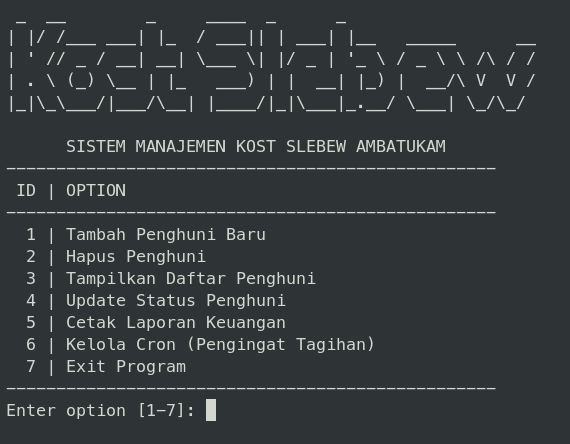
#### Tambah Penghuni
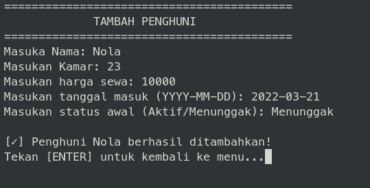
#### Hapus Penghuni
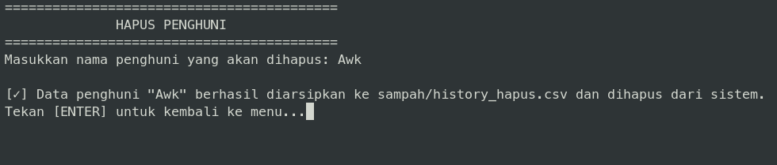
#### Daftar Penghuni
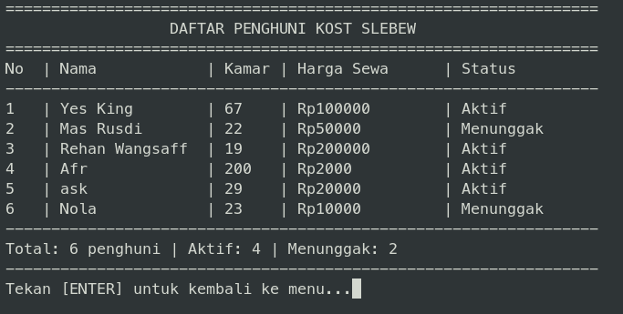
#### Update Status
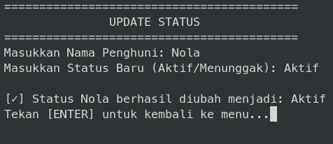
#### Laporan Keuangan
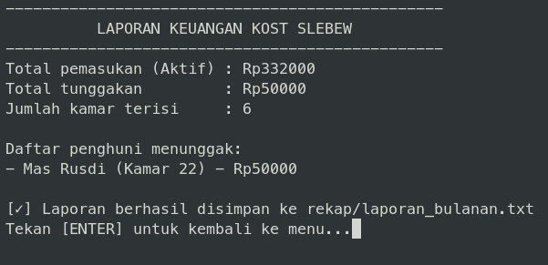
#### Kelola Cron
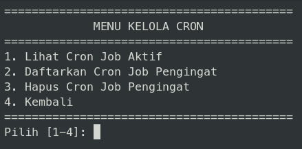
#### Tambah Cron
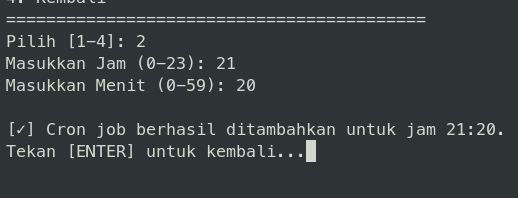
#### Daftar Cron Aktif
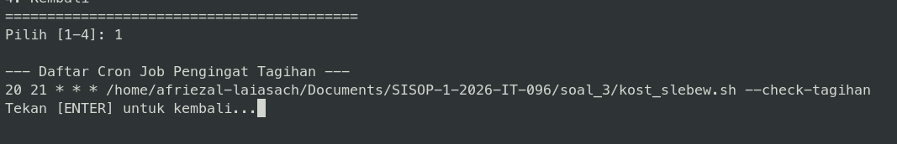
#### Hapus Cron
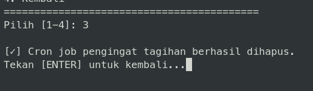  

### Kendala
Pada bagian ini, saya akan memberikan kendala selama pengerjaan saya:  
- Cron yang tidak dapat memberi pengingat sehingga saya sehingga saya harus mengupdate manual dengan ```./kost_slebew --check-tagihan```

